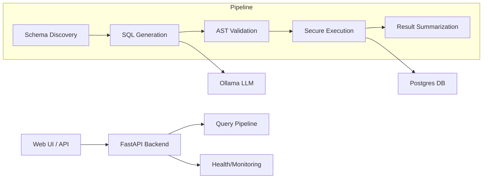

# QueryPilot — Safe AI-to-SQL Gateway

QueryPilot is a production-grade FastAPI service designed to safely expose a database to a Large Language Model (LLM). It translates natural language questions into reliable SQL queries, enforces strict security validation, and executes them against a PostgreSQL database with multi-layered safety controls.

## 🏗️ Architecture

QueryPilot is built using **Hexagonal Architecture (Clean Architecture)** to decouple core safety logic from external dependencies (DB, LLM, API).



## 🚀 Key Features

-   **Safety-First SQL Generation**: Treats LLM output as untrusted input.
-   **AST-Based Validation**: Uses `sqlglot` to parse SQL into an Abstract Syntax Tree, ensuring only read-only `SELECT` statements are executed.
-   **Dynamic Schema Discovery**: Automatically provides the LLM with the latest table structures, avoiding hardcoded schema drift.
-   **Layered Security**: Enforces database-level transaction timeouts and row limits.
-   **Hexagonal Design**: Core business logic is isolated and 100% testable without a live LLM or Database.
-   **Interactive Dashboard**: A modern HTML interface for natural language querying and result visualization.

## 🛠️ Setup & Installation

### 1. Prerequisites
- **Ollama**: Install [Ollama](https://ollama.com/) and pull the model:
  ```bash
  ollama pull llama3.1:latest
  ```
- **Docker**: For running the PostgreSQL database.

### 2. Start PostgreSQL
```bash
cd Query Pilot
docker compose up -d postgres
```

### 3. Install Python Dependencies
```bash
pip install -e ".[dev]"
```

## 📋 How to Run

1.  **Start the API**:
    ```bash
    uvicorn app.api.main:app --reload
    ```
2.  **Open the Dashboard**: Navigate to [http://localhost:8000](http://localhost:8000).

## 🛡️ Safety Rules
The system enforces strict validation on every generated query:
- ✅ **Allowed**: Single `SELECT` statements, Joins, Aggregations.
- ❌ **Blocked**: `INSERT`, `UPDATE`, `DELETE`, `DROP`, `ALTER`, `TRUNCATE`.
- ❌ **Blocked**: Multi-statement SQL (semicolon injection).
- ❌ **Blocked**: Comments used to hide extra statements.
- ❌ **Enforced**: Automatic `LIMIT` injection to prevent huge result sets.

## 🧪 Testing Strategy

Run the comprehensive test suite:
```bash
pytest tests/ -v
```

The test suite covers:
- **Unit Tests**: SQL validation logic (safe vs. unsafe).
- **Service Tests**: Schema discovery and result summarization.
- **API Tests**: Integration testing using a **Fake LLM** for fast, deterministic results.
- **Integration Tests**: End-to-to tests against a live Docker Postgres instance.

## 📖 Detailed Documentation
For deep-dive technical details and interview talking points, see the [INTERVIEW_GUIDE.md](./INTERVIEW_GUIDE.md).
