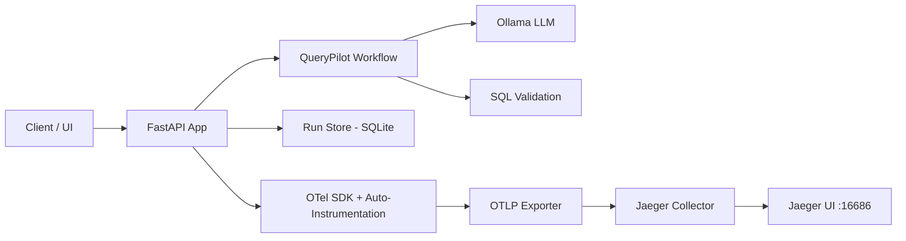

# TraceLab — AI Workflow Observability

TraceLab is a robust observability layer for Python AI workflows. It captures traces, timing, errors, and workflow metadata across LLM calls, retrieval, validation, tool execution, and database queries using OpenTelemetry and Jaeger.

## Architecture

TraceLab follows a modern observability pattern where the application is instrumented to emit traces that are collected and visualized in a central backend.



### Components
- **FastAPI Backend**: Orchestrates workflows and exposes the Run API.
- **Query Playground**: A premium, interactive UI at `/` for typing queries and inspecting results.
- **SQLite Run Store**: Persists run metadata (id, status, timestamps, errors, trace IDs).
- **OpenTelemetry SDK**: Handles span creation, context propagation, and exporting.
- **Auto-Instrumentation**: Automatically traces FastAPI requests, outbound HTTP (Ollama), and SQLite queries.
- **Jaeger**: All-in-one tracing backend for storage and visualization.

## Core Features Implemented

- ✅ **Full Observability**: Every step of the AI pipeline is instrumented with OTel spans.
- ✅ **Auto-Instrumentation**: Zero-code tracing for HTTP and database layers.
- ✅ **Query Playground**: Interactive UI to run queries and view results + trace links.
- ✅ **Real LLM Integration**: Uses Ollama `llama3.1:latest` for real-world SQL generation and summarization.
- ✅ **Error Tracing**: Captures exact failure points in complex workflows with stack traces.
- ✅ **Run Store**: Persistent history of all workflow executions.
- ✅ **Docker Ready**: One-command setup for the entire stack.

## Setup & Installation

### Prerequisites
1. **Ollama**: Install [Ollama](https://ollama.com/) and ensure the `llama3.1:latest` model is pulled:
   ```bash
   ollama pull llama3.1:latest
   ```
2. **Docker & Docker Compose**: Required to run the tracing stack.

### Local Installation (for Development)
```bash
cd Trace Lab
pip install -e ".[dev]"
```

## Running the Project

The easiest way to run the full stack is using Docker Compose:

```bash
cd Trace Lab
docker compose up --build -d
```

### Accessing the Services
- **Query Playground**: [http://localhost:8000](http://localhost:8000)
- **Jaeger UI**: [http://localhost:16686](http://localhost:16686)
- **API Docs (Swagger)**: [http://localhost:8000/docs](http://localhost:8000/docs)

## How to Test

### Automated Tests
Run the full test suite using `pytest`:
```bash
ENABLE_TRACING=false pytest tests/ -v
```
*Note: Tracing is disabled during unit tests to avoid dependency on a running Jaeger instance.*

### Manual Demo
1. Open the **Query Playground** ([http://localhost:8000](http://localhost:8000)).
2. Type a query like: `Show the top 5 customers by revenue`.
3. Click **Execute Workflow**.
4. Once finished, click the **View Trace** link to open Jaeger.
5. In Jaeger, you will see a detailed timeline of:
   - `request_received`
   - `schema_discovery`
   - `prompt_build`
   - `llm_sql_generation` (showing real LLM latency)
   - `sql_validation`
   - `db_execution`
   - `result_summarization`

### Testing Observability (Failure Case)
1. Switch the "Workflow Mode" to **Failure Mode** in the UI.
2. Type a query like: `Drop all tables`.
3. Click **Execute Workflow**.
4. The UI will show a `failed` status.
5. Click the trace link to see the **red error spans** in Jaeger, showing exactly where the validation failed.

## Project Structure
- `app/api`: FastAPI routes and models.
- `app/core`: Configuration and OTel SDK setup.
- `app/store`: SQLite run repository.
- `app/workflows`: Instrumented workflow implementations.
- `tests`: Unit and integration tests.
